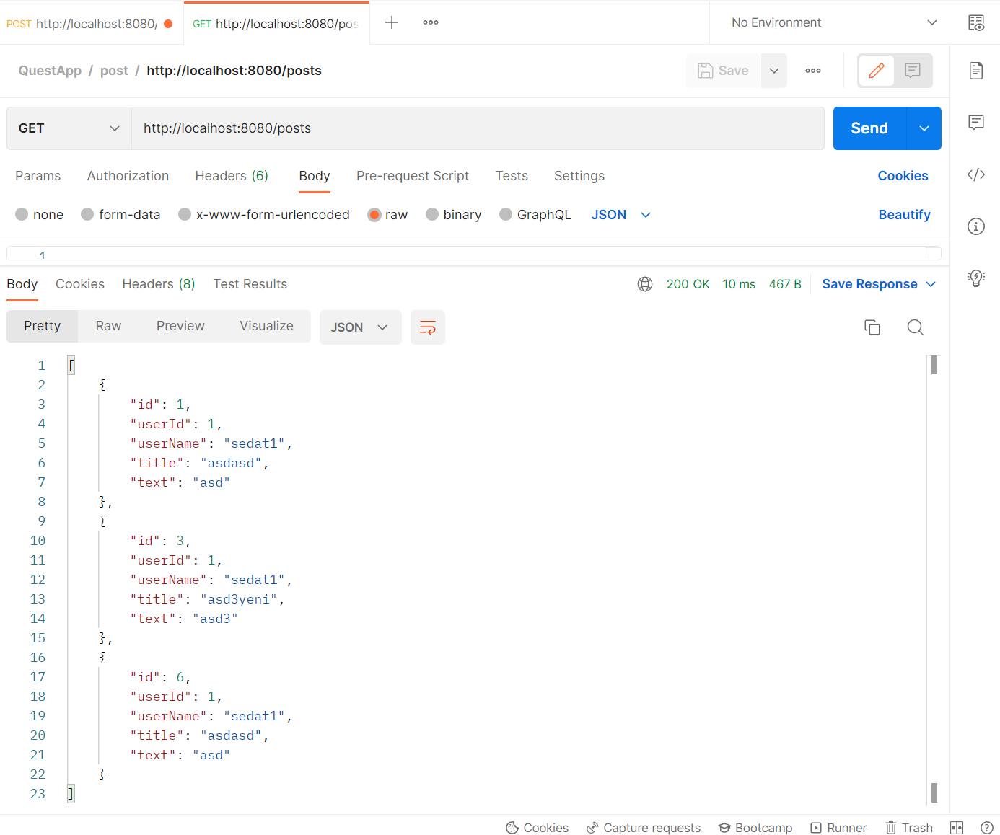

# Spring Basic Quest App

This project has been made as an exercise to learn the basic spring structure, api structure, hibernate and jpa basics and db connection.

Not supported Rest Api

Some features are not supported yet or fail to work properly.

## Screenshots

